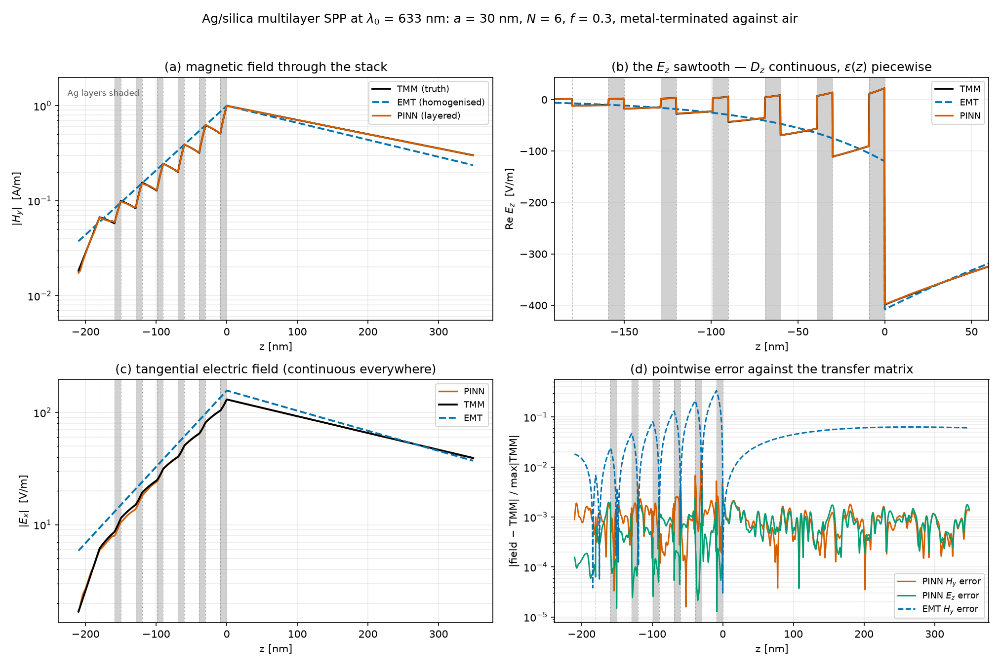

# Surface plasmon polaritons on metamaterials, learned from Maxwell's equations

[Repository on GitHub](https://github.com/JonesRobM/Metamaterials_PINN) ·
Dr Robert Michael Jones, Department of Physics, King's College London

Solvers for plasmonic metamaterials generally take one of two routes. They
**mesh** the structure, which becomes expensive when features are far smaller
than a wavelength, or they **homogenise** it into an effective medium, which is
cheap but approximate in ways that are rarely quantified.

This project takes a third route — learning the field directly from the
frequency-domain Maxwell equations with a physics-informed neural network — and,
more importantly, measures how well it works at every step against references
that are themselves independently validated.

## The headline result

A PINN trained on a **real Ag/silica multilayer** — 13 interfaces, 30 nm period
— predicts the bound surface mode far more accurately than the effective-medium
approximation normally used for such structures.

The Ez sawtooth in panel (b) is the point. The field is discontinuous
at every interface. The PINN (orange) tracks the transfer-matrix truth (black);
the homogenised model (dashed blue) draws a smooth curve straight through it.

| | Re *k*spp/k₀ | error | Im *k*spp (1/m) | error |
|---|---:|---:|---:|---:|
| Transfer matrix (truth) | 1.058313 | — | 8813 | — |
| Effective medium | 1.082930 | 2.33% | 11778 | 33.6% |
| **PINN (layered)** | **1.058365** | **0.005%** | **8982** | **1.92%** |

That is 472× closer in the real part and 17.5× closer in the imaginary part.
The field itself matches to a relative L2 of 5.8×10⁻³, against 0.247 for the
homogenised model.

### Why it works

The network emits a continuous Dz which is divided by the
piecewise-constant ε(z), so the physical Ez discontinuity is exact by
construction at every interface rather than something a smooth network has to
approximate. This *displacement adapter* generalises from one interface to many
for free — and Ez ends up the network's most accurately predicted
component, which is the opposite of what one would expect from a naive fit.

## Results at a glance

| Experiment | Reference | Field error | Dispersion error |
|---|---|---:|---:|
| Plane wave in free space | analytic | 7.8×10⁻⁴ | 8.7×10⁻⁵ |
| SPP, silver/air at 633 nm | analytic | 3.9×10⁻³ | 8.3×10⁻⁵ |
| SPP, uniaxial metamaterial | analytic | 9.0×10⁻³ | 1.6×10⁻⁴ |
| Dispersion, one ω-conditioned network | analytic | 1.9×10⁻² worst | 2.6×10⁻³ worst |
| Design space, one (ω, *f*)-conditioned network | analytic | 3.5×10⁻² worst | 3.4×10⁻³ worst |
| Real multilayer, 13 interfaces | transfer matrix | 5.8×10⁻³ | 4.9×10⁻⁵ |

Every experiment recovers its solution from the physics loss plus a boundary
anchor, with no interior data.

## What makes the claims checkable

- **[Physics](physics.html)** — conventions, the governing equations, how the
  metamaterial is constructed, and why these losses collapse to the zero field
  unless anchored.
- **[Validation](validation.html)** — each physics routine benchmarked against
  an exact solution or a literature value, not against other parts of the same
  codebase.
- **[Results](results.html)** — the experiments in detail, including a single
  network that reproduces a whole dispersion curve and an inverse-design loop
  run through a trained surrogate.
- **[Limitations](limitations.html)** — including a measurement showing that the
  project's own homogenisation step is an order of magnitude less reliable than
  the standard rule of thumb suggests.
