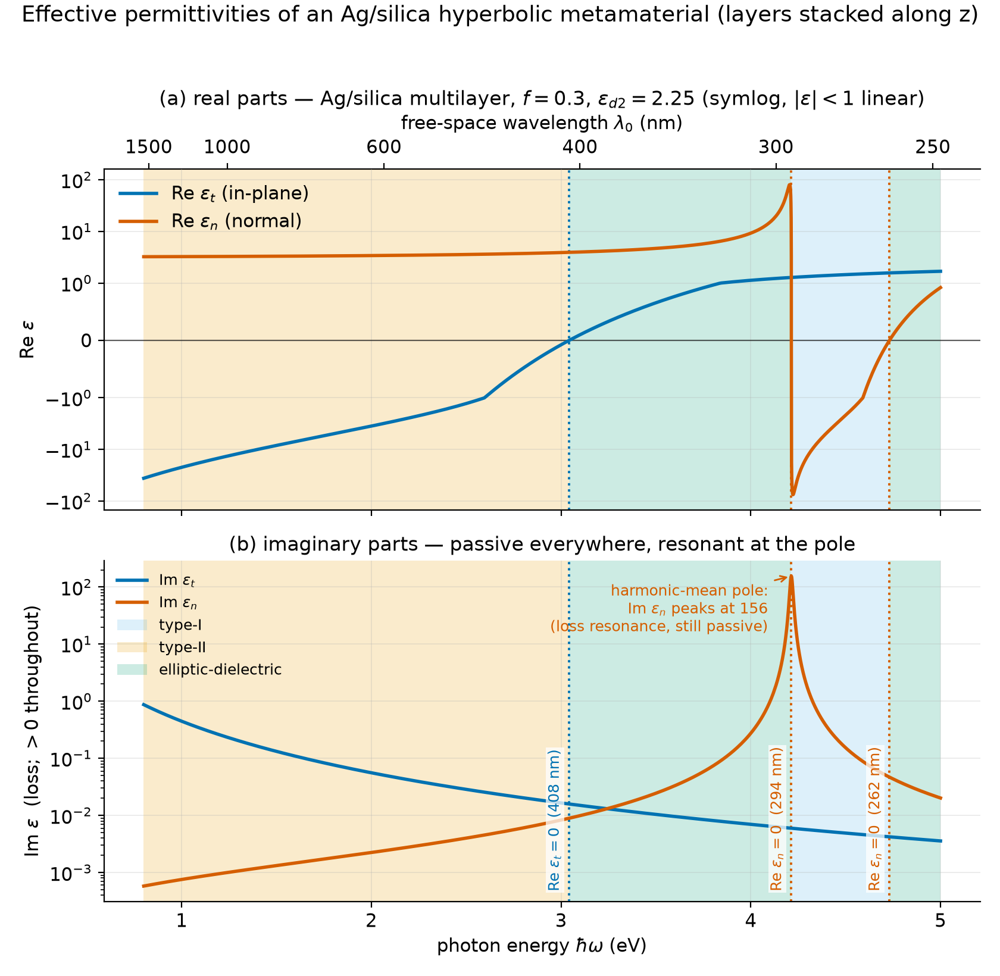

# Physics

[← Overview](index.html)

## Convention

Everything uses the `e^{-iωt}` time convention. Consequently lossy media have
Im ε > 0, bound or decaying solutions have Im *k* > 0, and transverse decay
constants satisfy Re κ > 0.

This matters more than it might appear. The codebase was once internally
inconsistent — the curl signs followed `e^{+iωt}` while every material parameter
assumed `e^{-iωt}`. Resolving it meant flipping two signs rather than negating
every permittivity in the project, and the convention is now stated in each
module's docstring.

## Governing equations

```
curl E =  i ω μ₀ H            (Faraday)
curl H = -i ω ε₀ ε̄ E          (Ampère)
div (ε̄ E) = 0                 (Gauss)
div H = 0                     (no magnetic monopoles)
```

Fields are represented as real tensors of shape `[N, 6, 2]` — six components,
split into real and imaginary parts — because complex autograd through the
spatial derivatives is more fragile than the explicit split.

## Uniaxial metamaterials

For an optical axis along ẑ the permittivity tensor is

```
ε̄ = diag(ε⊥, ε⊥, ε∥)
```

Rather than choosing ε⊥ and ε∥ by hand, this project derives them from a real
structure: an Ag/silica multilayer of period *a* with metal fill fraction *f*,
homogenised in the long-wavelength limit. Continuity of tangential **E** across
the layers gives the in-plane component as an arithmetic mean, and continuity of
normal **D** gives the normal component as a harmonic mean:

```
ε_t = f ε_m + (1-f) ε_d
ε_n = [ f/ε_m + (1-f)/ε_d ]⁻¹
```

with ε_m a Drude model for silver. The harmonic mean has an apparent pole where
its denominator vanishes. It is not a divergence and not a passivity violation:
for passive constituents Im ε_n stays positive everywhere, and the "pole" is a
finite loss resonance through which Re ε_n sweeps smoothly across zero — the
multilayer's epsilon-near-zero crossing.



The sign combinations partition the spectrum into type-I and type-II hyperbolic
and elliptic regions. A bound TM surface mode requires ε_t < 0 with ε_n > ε_d —
notably, the familiar isotropic threshold ε_m < −ε_d does *not* survive
anisotropy.

## Surface plasmon dispersion

For a uniaxial half-space against a dielectric,

```
k_spp² = k₀² ε_d ε_n (ε_t - ε_d) / (ε_t ε_n - ε_d²)
κ_d²   = k_spp² - ε_d k₀²
κ_m²   = ε_t (k_spp²/ε_n - k₀²)
```

Square-root branches are selected explicitly rather than left to the principal
branch, which picks the wrong sheet near resonances.

One subtlety found in the course of this work: with loss present, the matching
condition κ_d/ε_d + κ_m/ε_t = 0 also admits *radiative* quasi-roots whose decay
constants acquire small positive real parts. Identifying genuinely bound modes
therefore needs the additional non-radiative gate Re *k*<sub>spp</sub> > √ε_d k₀.

## The loss, and why it needs an anchor

```
L = w₁‖curl E - iωμ₀H‖² + w₂‖curl H + iωε₀ε̄E‖² + w₃‖div D‖² + w₄‖BC‖² + w₅‖anchor‖²
```

The Maxwell residuals are minimised **exactly** by E = H = 0. This is not a
theoretical concern: two experiments here converged confidently to the trivial
field before the anchor was added, one of them leaving a checkpoint whose field
amplitude was ~10⁻⁶ and whose loss curve looked entirely healthy.

Every experiment therefore carries a soft Dirichlet term on the domain boundary,
taken from the reference solution. Additional ingredients that proved necessary
for the harder cases:

- **Physics-loss ramping.** Weighting the anchor heavily at first and phasing
  the physics residuals in over the first quarter of training.
- **Per-medium loss weighting.** In SI units the metal-side Ampère residual is
  hundreds of times stiffer than the dielectric side, and dominates without
  rebalancing.
- **A dimensionless frame.** In SI the H-equation residual is smaller than the
  E-equation residual by the square of the free-space impedance (~10⁵), so an
  optimiser simply ignores it.
- **Input scaling by k₀(ω).** For frequency-conditioned runs, scaling
  coordinates by the *free-space* wavenumber makes the scaled system nearly
  frequency-independent. Scaling by k_spp would work better still, but would
  build in the very dispersion the experiment sets out to measure.
