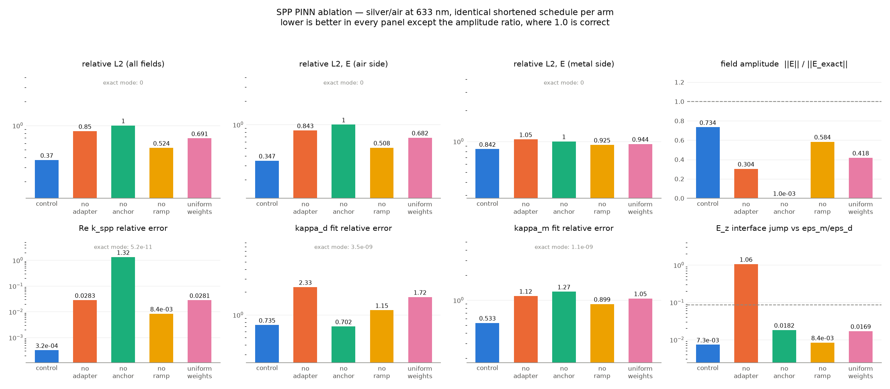
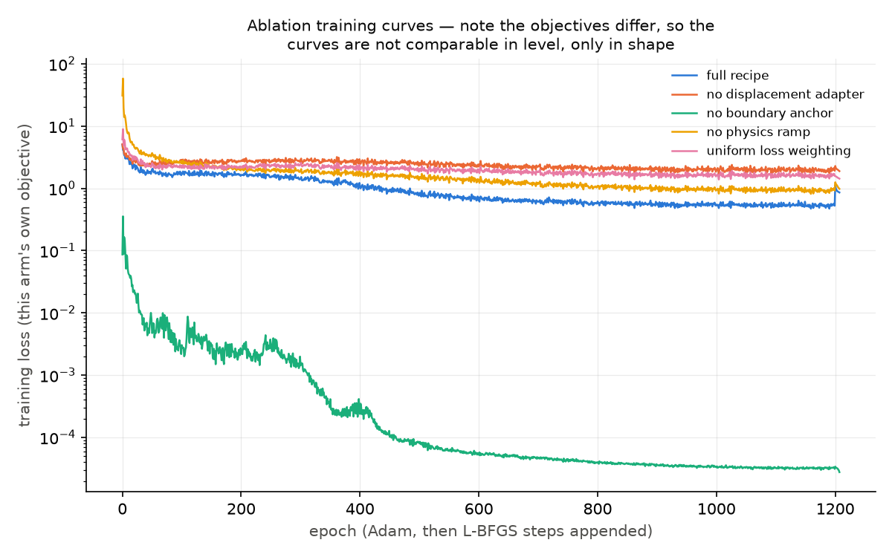

# Ablation of the SPP Recipe's Design Choices — Results

**Experiment:** `examples/ablation_study.py`
**Tests:** `tests/examples/test_ablation_study.py` (32 tests)
**Figures + metrics:** `figures/ablation/` (`results.json`, two PNGs)
**Checkpoints:** `artifacts/models/ablation_<condition>.partial.pth`
**Date:** 2026-09-02
**Runtime:** 27.9 min CPU for all five arms (1672 s of training, ~333 s each)

**Status: all four choices earn their place, in this order of importance —
boundary anchor > displacement adapter > per-medium loss weighting > physics
ramp.** On a schedule short enough to run five arms in half an hour, removing
any one of them makes the result worse on essentially every metric, and the
control is the only arm that recovers a **bound mode on both sides of the
interface** at all. The no-anchor arm collapses to the trivial field exactly as
the project has been claiming without evidence: ‖E‖ falls to **0.1 %** of the
analytical amplitude while its training loss drops **31 000× below** the
control's.

---

## 1. Why this exists

`README.md` calls the displacement adapter "the most reusable idea the project
has produced". `docs/plans/2026-09-01-hmm-surrogate-results.md` §9 says of a
sibling design choice, verbatim: *"Not ablated — asserted as a design choice and
tested for coverage, not for its effect on the final error."* That was true of
the adapter too, and of three other choices the SPP recipe rests on:

| Choice | The claim, as previously stated | Evidence, previously |
|---|---|---|
| **Displacement adapter** | the network emits continuous `D_z`, divided by the piecewise `ε(z)`, so the `E_z` jump is exact by construction rather than approximated | none — coverage tests only |
| **Boundary anchor** | without it the Maxwell residual loss is minimised exactly by `E = H = 0` | a remark in a docstring |
| **Physics ramp** | full physics weight from epoch 0 pins the network in the collapse basin before the anchor establishes the amplitude | one observation at boundary weight 10, in the `BOUNDARY_WEIGHT` note |
| **Per-medium loss weighting** | the metal-side curl-H residual is `(2π\|ε_m\|)² ≈ 335×` stiffer, so the metal terms are weighted `\|ε_m\|^{-p}` | one observation, same note |

This study measures all four.

## 2. Setup

**Case.** The single-interface silver/air SPP at λ₀ = 633 nm — `validate_spp.py
--case silver`: ε_m = −18.3 + 0.55j (z < 0), ε_d = 1 (z > 0), k_spp =
1.0209×10⁷ /m, κ_d = 2.386×10⁶ /m, κ_m = 4.368×10⁷ /m. Chosen because it is the
cheapest converging case in the repo and its reference,
`src.analytical.analytical_spp_fields`, is machine-precision.

**Conditions.** Each arm changes exactly one thing; `Condition` is a frozen
dataclass whose defaults *are* the control, so an ablation is literally one
keyword override, and
`test_each_arm_differs_from_the_control_in_exactly_one_field` asserts it.

| # | condition | what changes |
|---|---|---|
| 1 | `control` | nothing — the `validate_spp.py` recipe |
| 2 | `no_adapter` | `TwoMediumAdapter` removed; the MLP's channel 2 is read as `E_z` directly and `ε(z)` never divides it |
| 3 | `no_anchor` | boundary weight 100 → 0; interior physics + tangential continuity only |
| 4 | `no_ramp` | `physics_ramp_frac` 0.25 → 0; interior physics at full weight from epoch 0 |
| 5 | `uniform_weights` | metal-side curl and divergence weights `\|ε_m\|^{-1}` / `\|ε_m\|^{-1/2}` → 1, in both the Adam and L-BFGS phases |

**Held identical across arms.** Seed 0; the same 4×128 complex MLP with 128
Fourier features on (0.1, 40) — the adapter contributes no parameters, so all
five arms start from *bit-identical* weights (asserted in the tests); the same
stratified collocation sampling and the same per-epoch batch stream; the same
learning rate and cosine schedule; and the same validation points (a separate
seed, reset before evaluation, so no arm is graded on a luckier sample).

### 2.1 The shortened schedule — read this before quoting any number

| | this study | `validate_spp.py` production |
|---|---:|---:|
| Adam epochs | 1200 | 4000 |
| interior points / epoch | 1024 | 2048 |
| float64 L-BFGS steps | 8 | 150 |
| wall clock | 333 s / arm | 3791 s |
| control's rel L2 (E) | **0.370** | **0.0039** |

The control here is ~94× worse than the production run of the same recipe. That
is the price of five arms in half an hour, and it means **no absolute number in
this document is a statement about the method's accuracy** —
`figures/spp_validation/metrics.json` is the place for that. What the schedule
buys is that every arm gets the *same* shortened budget, so the *differences*
between arms — the entire question — remain meaningful. Two specific distortions
follow from it and are flagged where they appear: the air-side decay constant
κ_d is badly resolved in every arm (the control is 73 % off, against 0.28 % in
production), and the metal-side relative L2 is near 1 for everybody.

### 2.2 The measurement floor

Every metric is also computed on the **exact analytical mode**, pushed through
the identical pipeline, and reported as the `(exact mode)` row. Two of the
metrics have a floor that is not zero:

- **`ez_jump_rel_error`** measures `E_z(+2 nm)/E_z(−2 nm)` against the exact
  `ε_m/ε_d = 18.31`. The true mode's envelope decays across the 4 nm gap, so the
  exact mode itself measures 19.88, i.e. `ε_m/ε_d · exp((κ_m − κ_d)·2 nm)` — an
  8.6 % offset that is physics, not error.
- **`continuity_*_rel`** has the ~8 % floor documented in
  `src/experiments/measurement.py`, for the same reason.

## 3. Results

Lower is better everywhere except `‖E‖/‖E_exact‖`, where **1.0** is correct.

| condition | rel L2 | L2 air | L2 metal | ‖E‖/‖E_ex‖ | k_spp err | κ_d err | κ_m err | E_z jump err | bound mode? | final loss | tier |
|---|---:|---:|---:|---:|---:|---:|---:|---:|:--:|---:|---|
| **full recipe (control)** | **0.370** | **0.347** | **0.842** | **0.734** | **3.2e-04** | **0.735** | **0.533** | **7.3e-03** | **both sides** | 0.857 | **minimum** |
| no displacement adapter | 0.850 | 0.843 | 1.046 | 0.304 | 2.83e-02 | 2.33 | 1.12 | 1.06 | neither side | 1.887 | not met |
| no boundary anchor | 1.000 | 1.000 | 1.000 | 1.0e-03 | 1.32 | 0.702 | 1.27 | 1.8e-02 | air only | 2.76e-05 | not met |
| no physics ramp | 0.524 | 0.508 | 0.926 | 0.584 | 8.4e-03 | 1.15 | 0.899 | 8.4e-03 | metal only | 0.979 | not met |
| uniform loss weighting | 0.691 | 0.682 | 0.944 | 0.418 | 2.81e-02 | 1.72 | 1.05 | 1.7e-02 | neither side | 1.429 | not met |
| *(exact mode)* | 0 | 0 | 0 | 1.000 | 5.2e-11 | 3.5e-09 | 1.1e-09 | 8.6e-02 | both sides | — | — |

"Bound mode?" is `decay_sign_correct_air` / `_metal` from
`src.experiments.measurement.fit_decay_constants`: whether the fitted κ came out
**positive**, i.e. whether the field actually decays away from the interface on
that side. It is the cheapest statement of whether the arm found an SPP at all,
and **the control is the only arm that gets both sides right.**

Damage relative to the control, as a multiplier:

| condition | rel L2 | k_spp err | E_z jump err | metal curl-H residual | ‖E‖ retained |
|---|---:|---:|---:|---:|---:|
| no boundary anchor | **×2.70** | ×4100 | ×2.5 | ×5.6 | 0.1 % |
| no displacement adapter | **×2.30** | ×88 | **×145** | ×5.9 | 30 % |
| uniform loss weighting | **×1.87** | ×88 | ×2.3 | ×1.01 | 42 % |
| no physics ramp | **×1.42** | ×26 | ×1.1 | ×0.82 | 58 % |





## 4. Reading the arms

### 4.1 No boundary anchor — it collapses, and the loss says it succeeded

The most-repeated claim in the repo is confirmed, and in the most legible way
possible. `‖E‖/‖E_exact‖ = 1.03e-3` and `‖H‖/‖H_exact‖ = 9.7e-4`: the field is
three orders of magnitude below the mode. Relative L2 is exactly 1.000, which is
what "predicted ≈ 0" gives.

The instructive part is the *loss*. This arm's final objective is **2.76e-05**
against the control's 0.857 — it is 31 000× "better" by its own measure, and the
training curve (green, lower figure) descends smoothly to it with no sign of
trouble. That is the whole argument for the anchor in one picture: the residual
losses are homogeneous of degree 2 in the fields, `E = H = 0` is an exact global
minimiser, and nothing inside the optimisation can tell the difference between
finding the mode and finding nothing.

Two secondary observations. The κ_d fit still "succeeds" (0.702, no worse than
the control's 0.735) and the air-side decay sign is still correct — fitting a
slope to `ln|H_y|` of a near-zero field measures the network's residual noise
profile, not a mode, so those columns should be read as meaningless here rather
than as partial credit. The same goes for its `ez_jump_rel_error` of 0.018: the
adapter is still installed, so the ratio it imposes is right even when there is
no field to impose it on.

### 4.2 No displacement adapter — the largest structural failure

This is the arm the study was written for, and the adapter survives it.

The direct measurement first: `ez_jump_rel_error` is **1.061** against the
control's 0.0073, a factor of **145**. The measured ratio `E_z(0⁺)/E_z(0⁻)` is
**1.12** where it should be 18.31 — after 1200 epochs the continuous MLP has
learned essentially *no* discontinuity, exactly the failure the adapter exists
to make impossible. (The predicted value for a perfectly smooth field is 1.0;
1.12 is how much of the jump gradient descent managed to buy.)

The failure does not stay local. The metal-side curl-H residual is 2.35 against
the control's 0.399 (×5.9), overall relative L2 is 2.3× worse, k_spp is 88×
worse, and — most tellingly — **both** fitted decay constants come out with the
wrong sign, so this arm has not recovered a bound mode in any direction. The
field amplitude also falls to 30 % of the true mode: forced to smear an
18-to-1 jump across the guard band, the network partially retreats toward zero,
because a smaller field is a cheaper way to reduce a residual it cannot satisfy.

So the adapter's benefit is not confined to the interface, which is the
non-obvious part. It buys a correct jump *and* a metal half-space the interior
losses can actually be satisfied on.

One honest caveat on this metric. The control's 0.0073 is **below** the exact
mode's 0.086 floor — the control looks "better than perfect". It is not: the
adapter divides a smooth `D_z` by ε, and a smooth `D_z` barely varies over ±2 nm,
so the construction returns almost exactly `ε_m/ε_d` and under-represents the
physical envelope change that the true mode has. `ez_jump_rel_error` is
therefore an excellent *structural* diagnostic — is the jump there at all,
0.007 vs 1.06 — and a poor accuracy metric. It is reported as the former.

### 4.3 Uniform loss weighting — third, and it degrades everything mildly

Dropping the `1/|ε_m|` preconditioner costs 1.87× on relative L2, 88× on k_spp,
and loses the bound mode on both sides. The mechanism is visible in the training
curves: this arm's objective (pink) sits above the control's for the whole run
and never separates from the no-adapter arm, because the metal-side curl term —
weighted 18.3× harder than the control weights it during Adam, 4.3× during
L-BFGS — dominates the gradient and the anchor never gets to set the amplitude. `‖E‖` ends at 42 % of the true mode:
a partial version of the no-anchor collapse, arrived at by a different route.

Notably its *metal curl-H residual* (0.404) is no better than the control's
(0.399) despite weighting that term 18× harder. Pressing the stiff residual
harder did not reduce it; it only cost accuracy everywhere else. That is a
cleaner statement of the case for preconditioning than the original note made.

### 4.4 No physics ramp — real but the weakest of the four, and it refines the claim

The ramp is worth 1.42× on relative L2 and 26× on k_spp, and its removal loses
the air-side bound mode. But it does **not** produce the collapse the
`BOUNDARY_WEIGHT` note in `validate_spp.py` describes: `‖E‖/‖E_exact‖` is 0.584,
the largest of any ablated arm. The original observation was made at boundary
weight **10**; at the recipe's weight of **100** the anchor is evidently strong
enough to hold the amplitude on its own, and the ramp's remaining job is
accuracy rather than survival. The docstring's causal story ("without it the
stiff metal-side curl term pins the network in the trivial basin") is therefore
true of the *combination* it was observed in, not of the ramp alone at the
current anchor weight.

This arm is also the one place where an ablation *wins* a column: its metal
curl-H residual is 0.328 against the control's 0.399. Full physics weight from
epoch 0 does buy a better-satisfied interior residual — it just buys it by
sacrificing the field the residual is supposed to describe.

## 5. What this does and does not establish

**Establishes**, for the silver/air SPP at 633 nm under a fixed shortened
schedule and one seed:

1. All four choices are load-bearing. Every ablation is worse than the control
   on overall relative L2, on k_spp, and on whether a bound mode is recovered.
2. The no-anchor collapse is real, total (0.1 % amplitude), and invisible to
   the training objective. This was the project's most-repeated unevidenced
   claim; it holds.
3. The displacement adapter's effect is large and is *not* only cosmetic at the
   interface: ×145 on the jump it directly controls, but also ×5.9 on the metal
   interior residual and ×2.3 overall.
4. Per-medium weighting outranks the ramp.

**Does not establish:**

- **Anything about absolute accuracy.** See §2.1. A 94×-shortened control is not
  the method.
- **That the ordering holds at the production budget.** The ranking is measured
  where the control reaches rel L2 0.37; at rel L2 0.004 the terms that bind may
  well be different ones. The ramp in particular is a *transient* device, and a
  4000-epoch run gives the anchor far longer to win on its own — its measured
  importance here may be an underestimate or an overestimate.
- **Generality across cases.** One material case, one frequency, one geometry,
  one interface. Nothing here speaks to the uniaxial case, the 20-layer stack,
  or the (ω, f) surrogate — where the adapter has to impose a *different* jump
  at every conditioning point and might matter more, or where a layered stack's
  many small jumps might matter less.
- **Robustness to the seed.** n = 1 per arm. The differences reported are mostly
  large (≥1.4× on rel L2, ×26 to ×4100 on k_spp) and the collapse is
  three orders of magnitude, so seed noise is very unlikely to reverse the
  headline ordering — but the 1.42 vs 1.87 gap between the ramp and the
  weighting is well within what a handful of seeds could reorder, and should be
  treated as "these two are comparable and both smaller than the other two"
  rather than as a strict ranking.
- **That the choices are separable.** Each arm removes one thing from the full
  recipe. That measures each choice *in the presence of the other three*, which
  is the relevant question for a recipe, but it says nothing about interactions
  — §4.4 is a live example, where the ramp's importance clearly depends on the
  anchor weight it sits beside.

## 6. Reproducing

```bash
python examples/ablation_study.py --conditions all          # ~28 min CPU, all five arms
python examples/ablation_study.py --conditions no_anchor    # one arm, ~5.5 min
python examples/ablation_study.py --conditions control --resume   # continue a killed arm
python examples/ablation_study.py --quick --conditions control,no_adapter  # ~6 s smoke
```

A partial run merges into the existing `figures/ablation/results.json` rather
than replacing it, so the study can be run one arm per process inside a
wall-clock limit. Checkpoints are per-arm and atomic
(`artifacts/models/ablation_<key>.partial.pth`), carrying their loss history so
`--resume` finishes the *declared* schedule rather than extending it — an arm
that quietly trained longer than the others would invalidate the comparison.

## 7. Observations

1. **The loss is not the objective.** The no-anchor arm ends 31 000× below the
   control on its own loss and 100 % wrong on the field. Any future experiment
   that reports convergence without an independent field metric is reporting
   nothing; every `validate_*.py` in this repo already does the right thing, and
   this is the measurement that says why it matters.
2. **The metal half-space is where all four choices are actually fighting.**
   Two of the four (weighting, ramp) exist purely because of the `(2π|ε_m|)²`
   stiffness and a third (the adapter) removes the discontinuity that makes that
   stiffness bite hardest, and the metal-side relative L2 is the column where
   every arm — control included — does worst (0.84 to 1.05). The shortened
   schedule exaggerates this, but the ordering is the same as in production.
3. **`decay_sign_correct_*` is the most informative cheap metric in the repo**
   and is currently buried. It separates the five arms more sharply than
   relative L2 does: only the control recovers a bound mode on both sides, and
   the three arms with 0.5–0.85 relative L2 — which sound merely inaccurate —
   are each not-a-bound-mode in at least one direction.
4. **The adapter's benefit is nonlocal.** The prior claim was about the interface
   jump. The measured effect is 145× on the jump but also 5.9× on the metal
   interior curl residual and 2.3× overall. Worth restating in the README in
   those terms: it does not merely make `E_z` right at `z = 0`, it makes the
   metal-side physics tractable.
5. **A negative result did not turn up.** All four choices helped, which is the
   less interesting outcome; the closest thing to a surprise is §4.4, where the
   ramp's documented justification turns out to be a statement about a
   ramp-and-weak-anchor combination rather than about the ramp.

## 8. Next steps

1. Re-run the two closest arms (`no_ramp`, `uniform_weights`) at 3–5 seeds
   before quoting their ordering as a result. ~1 hour of CPU.
2. Ablate the adapter on the **20-layer** case, where `LayeredAdapter` imposes
   nineteen jumps instead of one, and on the **(ω, f) surrogate**, where the
   divisor is a function of both conditioning variables. Those are the cases the
   README's "generalises from one interface to many for free" claim actually
   rests on, and this study does not touch them.
3. Repeat the control-vs-`no_ramp` comparison at boundary weight 10 to confirm
   §4.4's reading — that the collapse in the original note was the joint effect
   of no ramp *and* a weak anchor.


---

## Addendum (2026-09-02, same day): a supervised baseline, at and beyond matched compute

The multilayer experiment's tractability probe is, methodologically, a
supervised baseline: plain regression against the transfer-matrix field, fresh
collocation points every epoch, evaluated on a fresh sample. It was originally
run only long enough to establish representability (2500 epochs, 48.8 s). Two
questions follow: had it plateaued, and what does it do with real compute?

| model | information used | compute | rel L2 |
|---|---|---:|---:|
| supervised regression, 2500 epochs | full TMM field everywhere | 48.8 s | 7.53e-3 |
| **PINN, full recipe** | **boundary values + Maxwell only** | 45.2 min | **5.75e-3** |
| supervised regression, 25 000 epochs | full TMM field everywhere | 10.0 min | **1.40e-3** |

(Data: `figures/ablation/supervised_baseline.json`. Same architecture, seed
and evaluation protocol throughout; the 10x run also wins in every region —
air 1.07e-3 vs 2.60e-3, stack 3.31e-3 vs 1.83e-2, substrate 4.96e-2 vs 0.104.)

It had **not** plateaued: the earlier "floor" reading was an artefact of the
short budget (MSE fell a further 24x between epoch 2500 and 25 000). Given a
quarter of the PINN's compute and the whole answer to copy, supervised
regression beats the physics-informed run by 4.1x.

**The honest reading.** These two models answer different questions. The
supervised net *compresses an existing solution* — it cannot be trained at all
unless the field is already known everywhere, which here means the transfer
matrix has already solved the problem. The PINN *solves* the problem from
boundary values and Maxwell's equations. Where a fast exact reference exists,
fitting its output is strictly better and cheaper than physics-informed
training — and calling the reference directly is better still (see
`examples/cost_analysis.py`). The PINN's value proposition is confined to the
regime this project has been explicit about all along: geometries where no
such reference exists. This measurement makes that confinement quantitative
rather than rhetorical.
