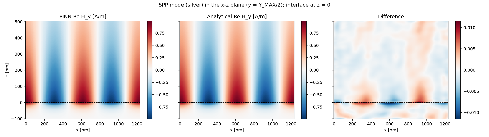
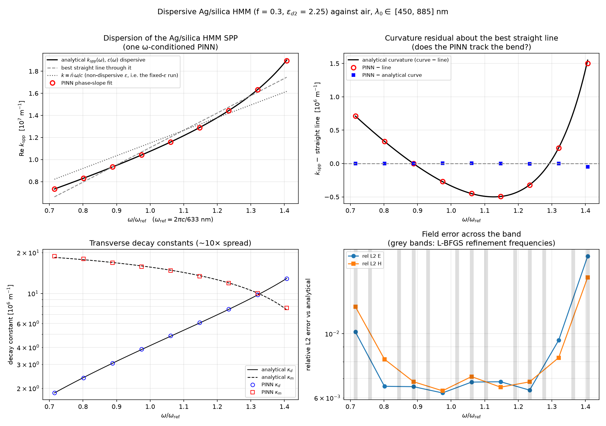
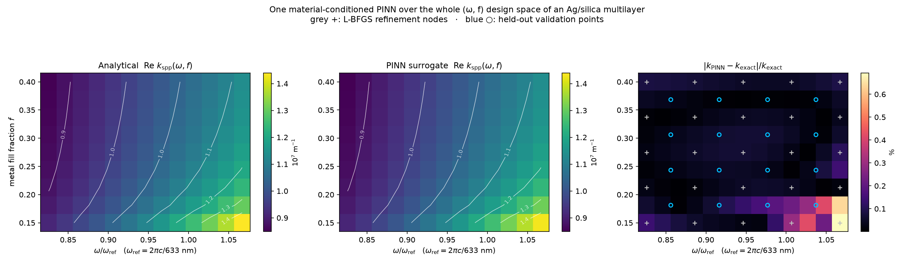
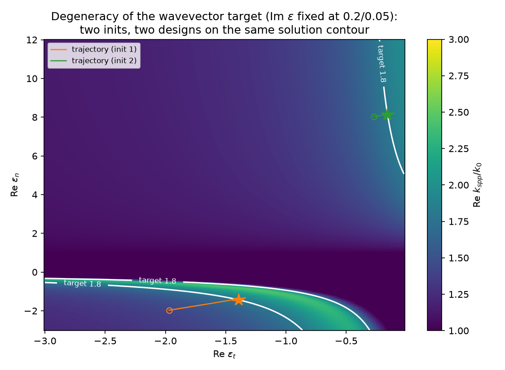
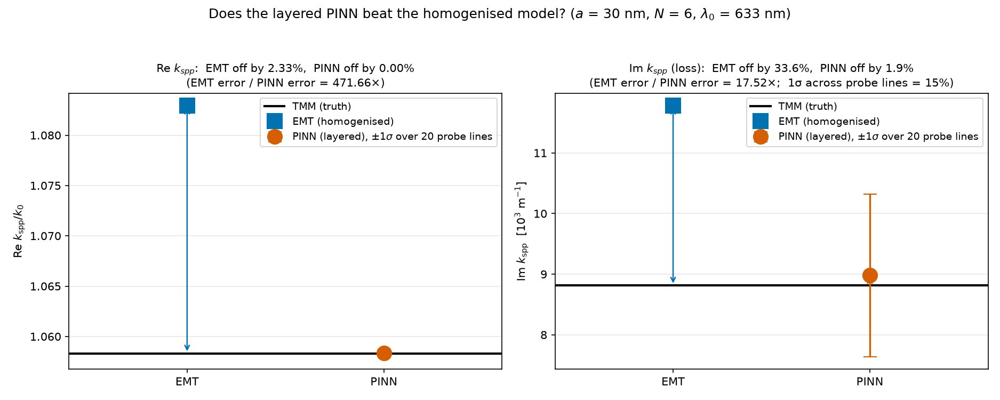
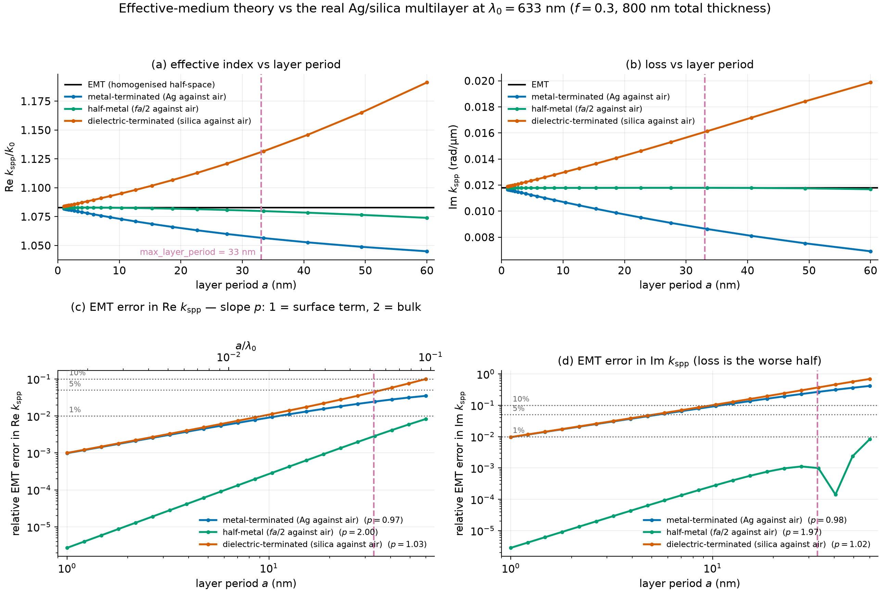

# Results

[← Overview](index.html)

Each experiment recovers a known solution from the physics loss plus a boundary
anchor, with no interior data. Full records — hyperparameters, failures,
diagnoses — are in the repository's `docs/plans/` directory.

## 1. Plane wave in free space

The control. Relative L2 of 7.8×10⁻⁴ against the analytic wave, wavelength
recovered to 8.7×10⁻⁵, E ⊥ H confirmed to 5×10⁻⁴.

This is also where the trivial-solution problem first appeared: an earlier
checkpoint trained on the curl residual alone had collapsed to a field amplitude
of ~10⁻⁶ with a perfectly healthy-looking loss curve.

## 2. Surface plasmon at a single interface

Silver/air at 633 nm reaches a relative L2 of 3.9×10⁻³ with the wavevector to
8.3×10⁻⁵ and both decay constants within 1%. The uniaxial metamaterial case
reaches 9.0×10⁻³ and 1.6×10⁻⁴.

## 3. One network for a whole dispersion curve

Conditioning the network on frequency lets a single model span a 65%-wide band
of a dispersive metamaterial, instead of one model per frequency.

The test is not whether it reproduces a line but whether it reproduces the
**bend**. Its residuals about a straight line trace the analytical curvature,
reproducing the curvature amplitude to 1.7% — a curvature-capture ratio of 37×.
Worst-case relative L2 across nine held-out frequencies is 1.9×10⁻².

Error is smallest mid-band and grows at both edges, the classic interpolation
signature: interior frequencies are constrained from both sides.

## 4. A surrogate over the design space

Extending the conditioning to the metal fill fraction *f* covers the whole
fabricable design space (ω, *f*) with one network. Conditioning on *f* rather
than on ε_t and ε_n independently matters: it guarantees every point in the
space corresponds to a structure that could actually be built.

Worst held-out relative L2 is 3.5×10⁻², with the wavevector to 0.34%; residual
error concentrates in one corner where ε_t approaches zero.

**Inverse design through the trained network.** Differentiating the recovered
wavevector with respect to the fill-fraction input and descending on it recovers
the closed-form answer to Δ*f* between 5×10⁻⁵ and 2×10⁻³ across three targets.
The closed form exists here, so this validates the mechanism rather than being
necessary — the same loop runs unchanged where no closed form does.

The analytics-only inverse design (over ε directly) also produces a
propagation-length versus confinement Pareto front spanning 3.7 to 660 µm, and
demonstrates the degeneracy of the problem: two distinct permittivity pairs
reaching the same target index.

## 5. The real multilayer

The payoff experiment: train on the actual 13-interface stack rather than its
homogenised approximation, and judge against a transfer-matrix solution.

| | Re *k*spp/k₀ | error | Im *k*spp (1/m) | error |
|---|---:|---:|---:|---:|
| Transfer matrix (truth) | 1.058313 | — | 8813 | — |
| Effective medium | 1.082930 | 2.33% | 11778 | 33.6% |
| **PINN (layered)** | **1.058365** | **0.005%** | **8982** | **1.92%** |

Field relative L2 is 5.8×10⁻³ against 0.247 for the homogenised model, a factor
of 43. A supervised probe run first — fitting the reference field directly, with
no physics loss — reached 7.5×10⁻³ in 43 seconds, confirming the architecture
could represent the field before committing to the full run. The trained PINN
then beat that probe.

The honest caveat: the imaginary part is inferred from a ~1% amplitude change
across the domain, so individual probe lines scatter by about 15%. Every
aggregate estimator lands between 1.7% and 3.2%, and the reported figure carries
that error bar.

## Where the effective medium goes wrong

The comparison above is only meaningful because the size of the homogenisation
error was measured independently first.

See [Limitations](limitations.html) for what that measurement implies about the
rest of the project's metamaterial results.
